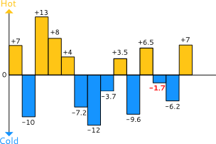

## Interview test

### Javascript

All exercices must be unit tested

### Exercice 1

In this exercise, you have to analyze records of temperature to find the closest to zero.



Implement the function `closestToZero` to return the temperature closer to zero which belongs to the array `ts`.

- If `ts` is empty, return 0 (zero).
- If two numbers are as close to zero, consider the positive number as the closest to zero (eg. if `ts` contains -5 and 5, return 5).

Input:

- Temperatures are always expressed with floating point numbers ranging from -273 to 5526.
- `ts` is always a valid array and is never `null`.


Test code:
```javascript
const ts = [7,-10,13,8,4,-7.2,-12,-3.7,3.5,-9.6,6.5,-1.7,-6.2,7];
const result = closestToZero(ts);

console.log(result); // -1.7

```

```javascript
const ts = [1, 2, 3, -1, -2, -3];
const result = closestToZero(ts);

console.log(result); // 1
```

Please provide additional use cases that you may think is relevant